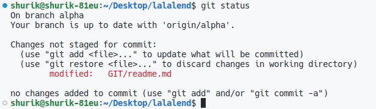
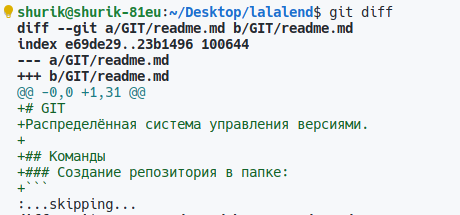
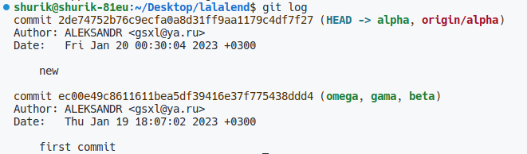
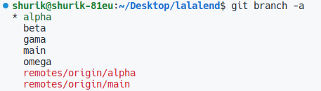

# GIT
Распределённая система управления версиями.

## Команды
### Создание репозитория в папке:
В терминале командой `cd` необходимо перейти в необходимую папку
```
git init
```
### Даобавление данных пользователя к репозитарию

```
git config user.name "{ИМЯ_ПОЛЬЗОВАТЕЛЯ}"
git config user.email "{ЭЛЕКТРОННЫЙ_АДРЕС_ПОЛЬЗОВАТЕЛЯ}"
```

### Добавление файла(ов) в созданный репозитория

Добавить 1 или несколько  новых фалов или после их редактирования через пробел с относительным путем к нему. 

```
git add {имя файла} {имя файла}
```
Добавить все файлы в репозитойри
```
git add .
```

### Отобразить изменения
Измененные файлы:
```
git status
```



Изменения в фалах:
```
git diff
```


Исторя изменений в ветке:
```
git log
```


### Ветки
Показать все ветки:
```
git branch
```


Создать новую ветку
```
git branch -M {имя_ветки}
```

Перейти в иную ветку
```
git checkout {ИМЯ_ВЕТКИ} 
```